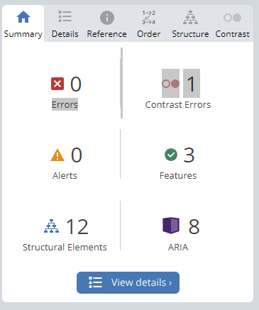

# Frontend Mentor - Officelite coming soon site solution

This is a solution to the [Officelite coming soon site challenge on Frontend Mentor](https://www.frontendmentor.io/challenges/officelite-coming-soon-site-M4DIPNz8g). Frontend Mentor challenges help you improve your coding skills by building realistic projects.  


## Technologies

The technologies used in this design are:

* HTML & SCSS & Ts
* Angular  
* Dayjs library

## Features

* Clean MarkUp
* Perfect Pixel Design
* Accessible App for everyone
* Responsive for different screen sizes
* Interactive form

## Setup

To run this app in development mode open the terminal and write the following:

```sh  
git clone https://github.com/Zakaria9375/fm-officelite.git 

cd fm-officelite  

npm install 
 
// you need to install angular cli to run this app in development mode
npm install -g @angular/cli

ng serve
```

## Links

* Officelite coming soon site challenge - [Challenge](https://www.frontendmentor.io/challenges/officelite-coming-soon-site-M4DIPNz8g)  
* Officelite coming soon site website - [Live](https://za-officelite.netlify.app/)  
* Frontend Mentor Profile - [@zakaria](https://www.frontendmentor.io/profile/Zakaria9375)

## Testing for Accessibility

Scopes of Accessibility testing for this app:  

* Zooming: No loss of content or functionality.
* Zooming (text-only): No loss of content till 200%.
* Keyboard-only: Interactive elements are accessible(focusable) and clickable.



## Retrospectives  

### What went well?

* Proper styling for angular application using SCSS.
* Perfect pixel design.
* Accessible App

### What could be improved?

* Improving accessibility for custom select.
* Automated testing for accessibility.
